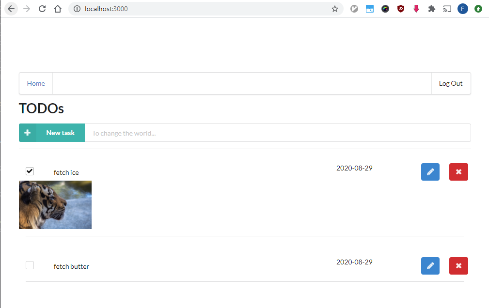

## Backend

To deploy an application run the following commands:

```
cd backend
npm install
sls deploy -v
```

## Frontend

To run a client application first edit the `client/src/config.ts` file to set correct parameters. And then run the following commands:

```
cd client
npm install
npm start 
```

Frontened locally at: [http://localhost:3000/](http://localhost:3000/)



