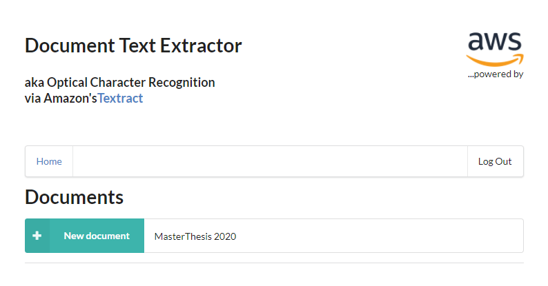
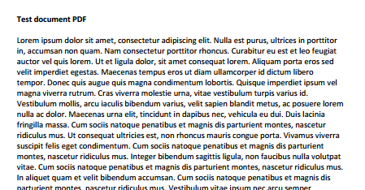
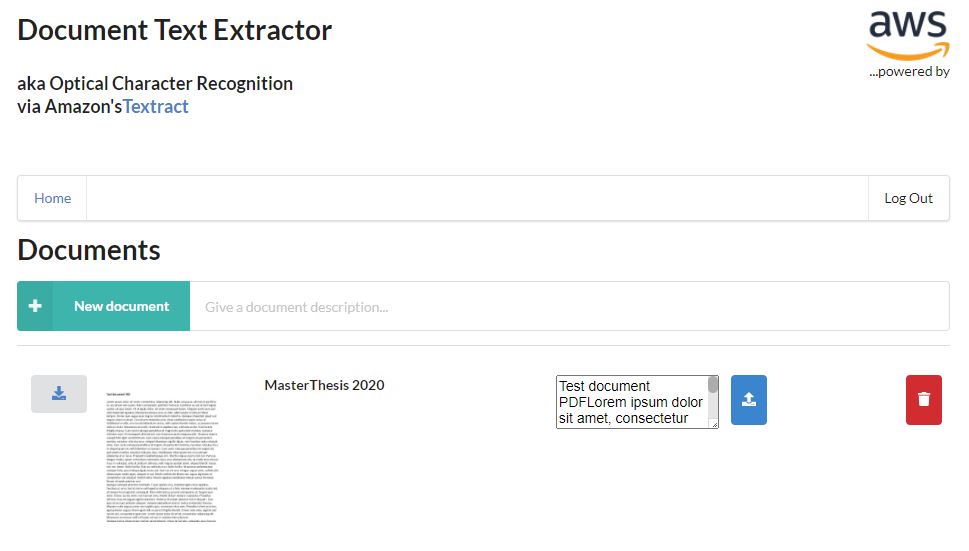
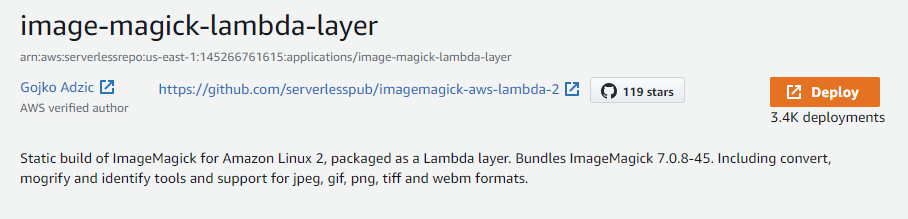
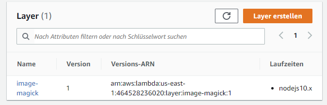

# Capstone - Text extractor

## Introduction

This application allows to upload documents (pdf) and extract its content as raw text. It features:

- User management
- Persistance of documents and their extracted content

## Demonstration

Putting a new document in the list starts by giving a brief description:



Afterwards the blue (upload) button allows to attach a document (pdf) to it.

The sample document `dummy.pdf` we will upload looks like:



Afterwards we can return to `Home` . Due to the asynchronous processing in the background one might need to refresh / relogin to the webpage to view the result of the processing. After a while it will look like:



What we get from this overview, from left to right:

- A `download link` to the original document / pdf.

- A preview image of the first page of the document.

- The title / description of the document

- The extracted text of the document. It can easily be copy & pasted. Simply click into the TextBox, then `ctrl+a, ctrl+c` and in an application of your choice `ctrl+v`.

The document can be replaced by another pdf or completely removed from storage.

The result (excerpt):

```
Test document PDFLorem ipsum dolor sit amet, consectetur adipiscing elit. Nulla est purus, ultrices in porttitorin, accumsan non quam. Nam consectetur porttitor rhoncus. Curabitur eu est et leo feugiatauctor vel quis lorem. Ut et ligula dolor, sit amet consequat lorem. Aliquam porta eros sedvelit imperdiet egestas. Maecenas tempus eros ut diam ullamcorper id dictum liberotempor. Donec quis augue quis magna condimentum lobortis. Quisque imperdiet ipsum vemagna viverra rutrum. Cras viverra molestie urna, vitae vestibulum turpis varius id.Vestibulum mollis, arcu iaculis bibendum varius, velit sapien blandit metus, ac posuere loremnulla ac dolor. Maecenas urna elit, tincidunt in dapibus nec, vehicula eu dui. Duis laciniafringilla massa. Cum sociis natoque penatibus et magnis dis parturient montes, nasceturridiculus mus. Ut consequat ultricies est, non rhoncus mauris congue porta Vivamus viverrasuscipit felis eget condimentum. Cum sociis natoque penatibus et magnis dis parturientmontes, nascetur ridiculus mus.
```

## Setup

As a prerequiste one needs to deploy the [image-magick-lambda-layer](https://serverlessrepo.aws.amazon.com/applications/arn:aws:serverlessrepo:us-east-1:145266761615:applications~image-magick-lambda-layer) .



The layer can afterwards be used by serverless by selecting the deployed arn within `serverless.yaml`.



## Technical Details

The application makes use of layers to add  [ghostscript](https://github.com/shelfio/ghostscript-lambda-layer) and [imagemick](https://github.com/serverlesspub/imagemagick-aws-lambda-2) layers which is required for the npm package [gm](https://aheckmann.github.io/gm/) of GraphicsMagick that we use for creating a preview image of a pdf file. 

Upon a File Upload a S3 Event is linked to a LambdaFunction which creates the preview Image as well as triggers a asynchronous text extraction via [Amazon Textract](https://aws.amazon.com/de/textract/). If the text extraction is finished it pushes a notification to an SNS topic. This topic is read from a Lambda function that upon notification then triggers the persistance of the text extraction result into the backend (here DynamoDB).

### Backend

To deploy the application run the following commands:

```
cd backend
npm install
sls deploy -v
```

### Frontend

To run a client application first edit the `client/src/config.ts` file to set correct parameters. And then run the following commands:

```
cd client
npm install
npm start 
```

Frontened locally at: [http://localhost:3000/](http://localhost:3000/)
